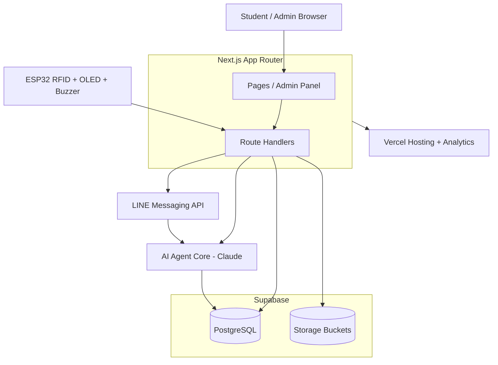

<div align="center">


# ASIA-BOT

**แพลตฟอร์มบริหารจัดการโรงเรียนแบบครบวงจร**

[](https://nextjs.org)
[](https://react.dev)
[](https://www.typescriptlang.org)
[](https://supabase.com)
[](https://vercel.com)
[](https://developers.line.biz)
[](https://espressif.com)

[](https://asia-bot.xyz)
[](./docs/report.md)

</div>

---

## Overview

ASIA-BOT คือระบบเว็บแอปสำหรับบริหารจัดการโรงเรียนแบบครบวงจร พัฒนาด้วย **Next.js 15 App Router**, **Supabase PostgreSQL**, **Supabase Storage**, **LINE Messaging API** และมีชุด **ESP32 RFID Controller** สำหรับเช็กชื่อเข้า-ออกแบบ Real-time ที่เก็บไว้เป็นโมดูลพร้อมเปิดใช้งานภายหลัง

ระบบรวมงานหลักของโรงเรียนไว้ในที่เดียว:

- บัตรนักเรียนดิจิทัลพร้อม QR Code
- ระบบ RFID Attendance ด้วย ESP32 + MFRC522 + OLED *(ซ่อนเมนูใช้งานจริงชั่วคราว แต่ API/firmware ยังอยู่)*
- ติดตามสถานะห้องเรียนและตารางสอนรายสัปดาห์
- จองห้องและจัดการห้องพร้อม amenities
- สหกรณ์โรงเรียนพร้อมระบบออเดอร์
- ระบบเบิกคุรุภัณฑ์ พร้อม stock, หมวดหมู่, รูปภาพ และ approval flow
- โปรเจกต์นักเรียนและผลประเมินด้วย Chart.js
- Feedback และคำขอแก้ไขข้อมูลนักเรียน
- Admin Panel แบบ Single-page พร้อม Role-based Access (superadmin / admin / staff)
- LINE Flex Messages รวมถึง order, feedback, booking, data change และ equipment พร้อมการส่งข่าวสารจริง
- **ASIA-BOT AI** — ผู้ช่วย AI ส่วนกลาง (Claude) ที่ตอบคำถามและ **ทำงานแทนได้** (จองห้อง/เบิกคุรุภัณฑ์/ส่ง feedback/ค้นเอกสาร) ผ่านทั้งเว็บและ LINE

> รายงานโครงงานฉบับสมบูรณ์อยู่ที่ [docs/report.md](./docs/report.md)  
> เอกสารกำกับการใช้งาน: [คู่มือผู้ใช้](./docs/user-manual.md), [นโยบายความเป็นส่วนตัว](./docs/privacy-policy.md), [เงื่อนไขการใช้งาน](./docs/terms-of-service.md)

---

## Features

| Module | Description |
|---|---|
| Student Portal | โปรไฟล์นักเรียน, รูปนักเรียน, QR/ข้อมูลบัตร, แก้ไขข้อมูลส่วนตัว |
| Student Entry Scanner | ดูประวัติสแกนรายวัน, ย้อนวันก่อนหน้า/ถัดไป, รายชื่อพร้อมรูปนักเรียน *(ซ่อนจากเมนูหน้าเว็บชั่วคราว)* |
| RFID Attendance | ESP32 + RFID ส่ง UID เข้า Next.js API แล้วบันทึก Supabase *(ซ่อนจาก navigation ชั่วคราว)* |
| Admin RFID Controller | หน้าแอดมินสำหรับทดสอบ UID, location, OLED preview, speaker feedback *(เข้าผ่าน URL ตรงได้เมื่อมีสิทธิ์)* |
| Class Track Room | รวมสถานะห้องเรียน, ตารางวันนี้, ห้องว่าง/ไม่ว่าง/ปิดบริการ และการจอง |
| Room Booking | จองห้อง, ดูสมาชิกกลุ่ม, อนุมัติ/ปฏิเสธ, จัดการห้องและ amenities |
| Shop | สหกรณ์โรงเรียน, สินค้า, ออเดอร์, ค่าธรรมเนียม, LINE Order Flex |
| Equipment Requests | รายการคุรุภัณฑ์, stock, รูปภาพ, คำขอเบิก/ยืม, การอนุมัติ และ LINE Equipment Flex |
| Projects | รายการโปรเจกต์, หน้าโปรเจกต์รายตัว, custom fields, evaluation analytics |
| Teacher Applications | หน้าใบสมัครครูและ admin review queue |
| Feedback | ความคิดเห็น/รายงานปัญหา พร้อม LINE Flex แจ้งแอดมิน |
| Data Requests | คำขอแก้ไขข้อมูลนักเรียน รวมคำขอเปลี่ยนชื่อไว้ด้วยกัน |
| **Student 360** (Phase 2) | ประวัติการศึกษา, ผลงาน/รางวัล, ผู้ปกครอง, การเปลี่ยนสถานภาพ และ roster ของแต่ละกลุ่มเรียน |
| **Student Self-Service** | นักเรียนกรอก/แก้ข้อมูลตัวเองได้ที่ `/my-profile`, ดูกิจกรรมและประวัติที่ `/student` |
| **Student Card** | ลงทะเบียนบัตรนักเรียนที่ `/student-card` + mini card ในหน้านักเรียน |
| **CSV Import** | นำเข้ารายชื่อนักเรียนทีละไฟล์ที่ `/admin/import` |
| **Assets & Maintenance** (Phase 3) | ทะเบียนครุภัณฑ์ ย้าย/จำหน่าย, แจ้งซ่อมที่ `/maintenance-request` พร้อมรูป ประวัติสถานะ และแจ้ง LINE |
| **Class Attendance** (Phase 4) | เช็กชื่อรายคาบ ครูสั่งงานจากหน้าเช็กชื่อได้ นักเรียนดูของตัวเองที่ `/my-attendance` |
| **Notification Centre** (Phase 6) | แจ้งเตือนรายบุคคล + กระดิ่งบน header พร้อมตั้งค่าการรับแจ้งเตือนรายคน |
| **Document Centre** (Phase 6) | คำขอเอกสาร/ใบรับรอง ที่ `/my-documents` และคิวอนุมัติที่ `/admin/documents` |
| **Chat / Agent Logs** | เก็บบทสนทนา AI ทั้งเว็บและ LINE ดูย้อนหลังที่ `/admin/chat-logs` |
| **Mycer** | แฟ้มสะสมผลงานบน subdomain แยก (`mycer.<domain>`) — robots/sitemap แยกตาม host |
| Admin Roles | superadmin, admin, staff พร้อมการจำกัดสิทธิ์แต่ละ tab (RBAC จริงอยู่ในตาราง `roles`/`permissions`) |
| LINE Broadcast | ส่งข่าวสาร LINE จริง ทั้งข้อความ รูปภาพ Flex ข่าวสาร ด่วน กิจกรรม และ Custom JSON |
| LINE Flex Test | ทดสอบ Order, Feedback, RFID, Booking, Student Data Change และ Custom JSON |
| **AI Agent (ASIA-BOT AI)** | ผู้ช่วย AI ส่วนกลาง (Claude Haiku) แบบ tool-calling — ดูข้อมูล + ทำ action (จองห้อง/ส่ง feedback/ยกเลิก/ค้น PDF) พร้อม RBAC, conversation memory, rich card และ Markdown table |
| AI Channels | ใช้ agent core เดียวกันทั้ง **เว็บ** (`ChatBubble`) และ **LINE** (webhook) — แยกธีม student/admin |
| Mascot System | คาแรกเตอร์ ASIA-BOT 12 อารมณ์ ใช้ใน empty state / สถานะต่างๆ ผ่าน `<Mascot>` component |
| Analytics | Vercel Analytics ผ่าน `@vercel/analytics/next` |

---

## Tech Stack

| Layer | Technology |
|---|---|
| Framework | Next.js 15 App Router + React 19 + TypeScript 5.8 |
| Styling | Tailwind CSS 3 |
| Database | Supabase PostgreSQL |
| Storage | Supabase Storage (student photos, product images, feedback images) |
| Auth | Custom session (students) + bcryptjs (admins) |
| Hosting | Vercel (Fluid Compute) + Vercel Analytics |
| Notifications | LINE Messaging API — Flex Messages + Broadcast |
| AI | Anthropic Claude (`@anthropic-ai/sdk`) — agent core แบบ tool-calling (model `claude-haiku-4-5`) |
| Charts | Chart.js 4 + react-chartjs-2 |
| Hardware | ESP32 DevKit V1 + MFRC522 RFID + OLED SSD1306 + Buzzer |
| Payment | Stripe |
| QR Code | qrcode |

---

## Architecture

เปิดแผนภาพแบบแก้ไขได้ใน Draw.io / diagrams.net:

```txt
docs/asia-bot-system.drawio
```

ไฟล์นี้มี 2 หน้า:

- `System Architecture`
- `Schema Visualizer`



> AI Agent core เป็นตัวกลางตัวเดียว (`src/lib/agent`) ที่ทั้ง `/api/chat` (เว็บ) และ LINE webhook เรียกใช้ — ดูรายละเอียดที่ [AI Agent (ASIA-BOT AI)](#ai-agent-asia-bot-ai)

---

## Project Structure

```txt
src/
├── app/
│   ├── page.tsx                    # หน้าแรก
│   ├── admin/                      # Admin Panel
│   ├── api/                        # Next.js Route Handlers
│   ├── class-track-room/           # ติดตามห้องเรียน + จองห้อง
│   ├── become-teacher/             # แบบฟอร์มสมัครครู
│   ├── equipment-request/          # เบิก/ยืมคุรุภัณฑ์
│   ├── feedback/                   # Feedback / report
│   ├── login/                      # Student login
│   ├── project/[slug]/             # หน้าโปรเจกต์รายตัว
│   ├── projects/                   # รวมโปรเจกต์
│   ├── register/                   # สมัครนักเรียน
│   ├── rfid/                       # RFID legacy/public page
│   ├── shop/                       # สหกรณ์โรงเรียน
│   ├── student/                    # หน้าโปรไฟล์นักเรียน
│   ├── student-entry-scanner/      # ดูประวัติการสแกน
│   ├── Qman/                       # ระบบคิว/จองคิวตัวอย่าง
│   └── QQ/                         # ระบบร้านค้า/QR ตัวอย่าง
├── components/
│   ├── Header.tsx
│   ├── Footer.tsx
│   ├── StudentAvatar.tsx
│   ├── ChatBubble.tsx              # AI chat widget (web) — student + admin theme
│   ├── Mascot.tsx                  # คาแรกเตอร์ ASIA-BOT (12 อารมณ์) + empty state
│   └── admin/RfidConsole.tsx
├── lib/
│   ├── admin-auth.ts               # Admin auth/session guard
│   ├── amenities.ts                # Room amenities
│   ├── config.ts                   # Site config / quick links
│   ├── line.ts                     # LINE Flex builders
│   ├── session.ts                  # Student session helpers
│   └── agent/                      # AI Agent core (ASIA-BOT AI)
│       ├── core.ts                 # tool-calling loop (Claude)
│       ├── context.ts              # system prompt builder
│       ├── nav.ts                  # [NAV:] tag parser (web + LINE)
│       ├── channels/               # web.ts, line.ts request builders
│       └── tools/                  # attendance, booking, shop, schedule, …
└── types/
    └── database.ts

arduino/
└── RFID_ESP32/                     # ESP32 RFID controller sketch

supabase/
schema.sql                          # SQL/schema reference
```

---

## Admin Tabs

ตั้งแต่ commit `dd6526e` (*move the admin panel onto real routes*) หน้าใหม่ย้ายมาเป็น **route จริง** แล้ว
ไม่ได้อยู่ใต้ `?tab=` เดิมทั้งหมด — ของเก่ายังเหลือไว้ที่ `/admin/[tab]` จนกว่าจะย้ายครบ

| Route จริง | ใช้ทำอะไร |
|---|---|
| `/admin` | Dashboard |
| `/admin/students` · `/admin/students/[id]` | จัดการนักเรียน + Student 360 รายคน |
| `/admin/import` | นำเข้ารายชื่อนักเรียนจาก CSV |
| `/admin/class_groups` | กลุ่มเรียนและ roster |
| `/admin/class-attendance` | เช็กชื่อรายคาบ + สั่งงาน |
| `/admin/assets` · `/admin/assets/[id]` | ทะเบียนครุภัณฑ์ ย้าย/จำหน่าย |
| `/admin/maintenance` · `/admin/maintenance/[id]` | งานแจ้งซ่อมและประวัติสถานะ |
| `/admin/documents` | คิวคำขอเอกสาร (Phase 6) |
| `/admin/shop` · `/admin/shop/orders` | สินค้าและออเดอร์สหกรณ์ |
| `/admin/chat-logs` | บทสนทนา AI ย้อนหลัง (เว็บ + LINE) |
| `/admin/[tab]` | tab เดิมที่ยังไม่ได้ย้าย (ตารางด้านล่าง) |

Tab เดิมที่ยังเข้าผ่าน `/admin/[tab]`:

| Tab | Purpose |
|---|---|
| `dashboard` | ภาพรวม, สถิตินักเรียน, Chart.js, สถานะรายวัน |
| `students` | จัดการนักเรียน, รูปนักเรียน, card/list/grid |
| `data_requests` | คำขอแก้ไขข้อมูลนักเรียน |
| `entrylogs` | บันทึกเข้า-ออกทั้งหมดแบบรายวัน *(ซ่อนจาก navigation ชั่วคราว)* |
| `checkin_school` | เช็กชื่อโรงเรียน *(ซ่อนจาก navigation ชั่วคราว)* |
| `checkin_library` | เช็กชื่อห้องสมุด *(ซ่อนจาก navigation ชั่วคราว)* |
| `checkin_meeting` | เช็กชื่อห้องประชุม *(ซ่อนจาก navigation ชั่วคราว)* |
| `rfid` | RFID Controller สำหรับแอดมิน *(ซ่อนจาก navigation ชั่วคราว)* |
| `bookings` | รายการจองห้อง |
| `rooms` | จัดการห้องและสิ่งอำนวยความสะดวก |
| `products` | จัดการสินค้า |
| `shoporders` | ออเดอร์สหกรณ์ |
| `equipment_items` | จัดการคุรุภัณฑ์, หมวดหมู่, รูปภาพ, stock และสถานะ |
| `equipment_requests` | อนุมัติ/ปฏิเสธ/อัปเดตคำขอเบิกคุรุภัณฑ์ |
| `projects` | จัดการโปรเจกต์ |
| `evaluations` | ผลประเมินและ Chart.js |
| `class_groups` | กลุ่มเรียน |
| `class_schedule_weekly` | ตารางสัปดาห์ |
| `class_schedule_override` | แก้วันพิเศษ |
| `teachers` | ข้อมูลครูผู้สอนสำหรับตารางเรียน ไม่ใช่ role ผู้ใช้ |
| `teacher_applications` | ตรวจใบสมัครครูจากหน้า `/become-teacher` |
| `feedbacks` | Feedback |
| `admins` | จัดการผู้ดูแลระบบ |
| `line_broadcast` | ส่งข่าวสาร LINE จริง ทั้งข้อความ รูปภาพ Flex และ Custom JSON |
| `settings` | System checklist และ LINE Flex test |

Admin UX:

- กลุ่มเมนูเช็กชื่อและอุปกรณ์ RFID (`entrylogs`, `checkin_school`, `checkin_library`, `checkin_meeting`, `rfid`) ถูกซ่อนจาก sidebar/admin navigation ชั่วคราว เพื่อพักการใช้งานหน้าบ้าน แต่ route/API ยังอยู่สำหรับเปิดกลับหรือทดสอบผ่าน URL ตรงตามสิทธิ์
- Sidebar แสดง badge แบบ dot number เฉพาะเมนูที่มีรายการต้องดู เช่น คำขอข้อมูล, จองห้อง, สินค้าใกล้หมด, คำสั่งซื้อ, ออเดอร์เบิก, feedback และใบสมัครครู
- ปุ่มค้นหากลางใน topbar เปิดด้วย `Ctrl+K` ได้ ค้นหาได้ทั้งเมนูและรายการจริง เช่น นักเรียน, สินค้า, คำสั่งซื้อ, คุรุภัณฑ์ และออเดอร์เบิก
- มุมมอง `Grid / List / Card` ใช้ค่าเดียวกันทั้ง admin และเก็บใน `localStorage` (`asia_admin_view_mode`)
- ช่องค้นหาและ filter หลักในแต่ละ tab เก็บใน `localStorage` แยกตามหน้า เพื่อกลับมาแล้วใช้งานต่อได้

---

## Role Permissions

ระบบสิทธิ์มี **สองชั้น** ที่อยู่ร่วมกันระหว่างการย้ายของ Phase 1:

**1. Legacy — คอลัมน์ `admins.role`** (ยังใช้เช็กใน API เดิม)

| Role | Summary |
|---|---|
| `superadmin` | จัดการทุกระบบ, admin accounts, delete/admin-level operations |
| `admin` | ครูแยกตามฝ่าย — จัดการข้อมูลหลัก, นักเรียน, ห้อง, ตาราง, RFID, โปรเจกต์ |
| `staff` | **สภานักเรียน (เป็นนักเรียน ไม่ใช่เจ้าหน้าที่)** — ดูข้อมูลและใช้งานบางส่วน เช่น dashboard, students, checkin, bookings, shop, projects, feedback, settings |

**2. RBAC จริง — ตาราง `roles` / `permissions` / `role_permissions` / `user_roles`**
นิยามอยู่ใน [src/lib/rbac/definitions.ts](./src/lib/rbac/definitions.ts) มีบทบาทละเอียดกว่า:
`guest`, `student`, `parent`, `teacher`, `librarian`, `cooperative_staff`, `school_admin`, `executive`, `it_admin`, `superadmin`

การ map ระหว่างสองชั้น (`ADMIN_ROLE_MAP`): `superadmin` → `SUPER_ADMIN`, `admin`/`staff` → `school_admin`
`staff` map เป็น `ACADEMIC` ในฝั่ง agent เพราะใกล้เคียงกับสิ่งที่ staff เข้าถึงได้อยู่แล้วมากที่สุด

> ⚠️ `NAV_SECTIONS` ของ admin panel **ยังไม่ gate ตาม role** — ปัจจุบัน `staff` เปิดได้ทุก tab
> ข้อตกลงชั่วคราวคือ API ที่เป็น mutation ตรวจ `["superadmin","admin"]` ส่วน read ไม่ตรวจ

---

## RFID Flow

```txt
นักเรียนแตะบัตร
↓
ESP32 อ่าน UID
↓
ESP32 ส่ง HTTP POST ไป Next.js API
↓
Next.js ตรวจ UID ใน Supabase
↓
บันทึก attendance / attendance_logs
↓
ส่งผลกลับ ESP32
↓
ESP32 beep + OLED display
```

ตัวอย่าง request:

```http
POST /api/rfid/scan
Content-Type: application/json
```

```json
{
  "uid": "04B53182D01E90",
  "location": "school",
  "device_id": "ESP32-RFID-01",
  "station_secret": "optional-secret"
}
```

---

## LINE Flex Messages

ระบบมี LINE Flex หลัก 6 แบบ:

| Flex | Color | Purpose |
|---|---:|---|
| Order Flex | `#EC4899` | แจ้งออเดอร์สหกรณ์ |
| Feedback Flex | `#84D4FA` / `#FF7070` | ความคิดเห็น / รายงานปัญหา |
| RFID Attendance Flex | `#84D4FA` | แจ้งเตือนสแกนเข้า-ออก |
| Booking Flex | `#F59E0B` | คำขอจองห้อง |
| Student Data Change Flex | `#6366F1` | คำขอแก้ไขข้อมูลนักเรียน |
| Equipment Flex | `#F59E0B` | คำขอเบิก/ยืมคุรุภัณฑ์ |

ระบบส่งข่าวสารจริงจากผู้ดูแลรองรับ:

| Message | ใช้ทำอะไร |
|---|---|
| Text Message | ส่งข้อความทั่วไป |
| Image Message | ส่งรูปภาพโดยตรง |
| News Flex | ส่งข่าวสารทั่วไป |
| Urgent Flex | ส่งประกาศด่วน |
| Event Flex | ส่งกิจกรรม |
| Notice Flex | ส่งแจ้งเตือน |
| Custom JSON | ส่ง payload ที่ผู้ดูแลเขียนเอง |

ส่งข่าวสารจริงได้ที่:

```txt
/admin?tab=line_broadcast
```

ทดสอบได้ที่:

```txt
/admin?tab=settings
```

### ปลายทางแจ้งเตือน

ปลายทางของแต่ละหมวด (`admin`, `attendance`, `booking`, `order`, `feedback`, `equipment`, `maintenance`, `data_change`, `broadcast`)
อ่านจากตาราง **`line_notification_channels`** เป็นหลัก ([src/lib/line-targets.ts](./src/lib/line-targets.ts))
env `LINE_GROUP_*` เป็นแค่ fallback สำหรับตอนที่ยังไม่ได้รัน migration

- ถ้าไม่เจอปลายทางของหมวดนั้น จะตกไปใช้ปลายทางของหมวด `admin`
- แต่ละหมวดหยิบ **แถวเดียว** เรียงตาม `is_default DESC, created_at ASC` — ถ้าเปิดใช้งานหลายแถวโดยไม่ตั้ง `is_default` แถวที่สร้างก่อนจะชนะ
- กลุ่มที่บอทถูกเชิญเข้าไปใหม่จะถูกบันทึกอัตโนมัติเป็น `is_active = false` รอ superadmin เปิดใช้ (`recordLineGroupSeen`)

### การผูกบัญชีนักเรียน

การเชื่อม LINE **ทำจากฝั่งแชทเท่านั้น** ไม่มี endpoint สำหรับกรอก `line_user_id` เอง
เพราะเป็นค่าที่ LINE ออกให้ เจ้าตัวไม่มีทางรู้ และถ้าเปิดให้กรอกได้ ใครที่รู้รหัสนักเรียนคนอื่นก็ดักรับแจ้งเตือนแทนได้

1. นักเรียนแอดเพื่อน LINE OA (ปุ่มในหน้า `/student` มาจาก `NEXT_PUBLIC_LINE_ADD_FRIEND_URL`)
2. พิมพ์ **รหัสนักเรียน** ส่งเข้าแชท
3. [webhook](./src/app/api/line/webhook/route.ts) เขียน `line_user_id` ลง `students` แล้วตอบ Flex ยืนยัน
4. ยกเลิกเองได้ที่หน้านักเรียน → `DELETE /api/student/line-link`

### ตั้งค่า Webhook

**LINE Developers Console** → channel Messaging API → แท็บ Messaging API:

| ตั้งค่า | ค่า |
|---|---|
| Webhook URL | `https://<domain>/api/line/webhook` |
| Use webhook | เปิด |

**LINE Official Account Manager** → ตั้งค่า → การตอบกลับ:

- โหมดตอบกลับ = **แชท**, Webhook = **เปิด**
- **ปิด** ตอบกลับอัตโนมัติ (Auto-reply) ไม่งั้นข้อความสำเร็จรูปจะแย่งตอบแทน webhook
- เปิด "อนุญาตให้เชิญเข้ากลุ่ม" ถ้าต้องการแจ้งเตือนเข้ากลุ่ม

ทุก request ถูกตรวจ `x-line-signature` ด้วย `LINE_CHANNEL_SECRET` (`verifyLineSignature` ใน `src/lib/line.ts`)
ถ้า secret ไม่ตรงกับ channel เดียวกับ `LINE_TOKEN` จะได้ `401 invalid signature` ทุกครั้ง
LINE ยิงเข้า `localhost` ไม่ได้ — ตอน dev ต้องเปิด tunnel (cloudflared / ngrok)

**ไม่ต้องใช้ Assertion Signing Key** — ระบบใช้ long-lived channel access token (`LINE_TOKEN`) ตรงๆ ไม่ได้ใช้ JWT-based token (v2.1)

---

## AI Agent (ASIA-BOT AI)

ASIA-BOT AI คือผู้ช่วย AI ส่วนกลางที่ขับเคลื่อนด้วย **Anthropic Claude** (`claude-haiku-4-5`) แบบ tool-calling — core ตัวเดียว (`src/lib/agent`) ใช้ร่วมกันทุกช่องทาง ตอบได้ทั้งคำถามและ **ลงมือทำ action** แทนผู้ใช้

### ความสามารถ

| ประเภท | Tools |
|---|---|
| ดูข้อมูล | เข้า-ออกโรงเรียน (รายวัน/สรุป/ช่วงเวลา), ตารางเรียน, การจอง, ออเดอร์, สินค้า, โปรไฟล์ |
| **ทำ action** | `create_booking` / `cancel_booking` (จองห้อง), `request_equipment`, `submit_feedback`, และ action อื่นตามสิทธิ์ที่เปิดใช้งานในระบบ |
| ค้นเอกสาร | `list_documents` / `search_documents` — ถาม-ตอบจากไฟล์ PDF ที่อัปโหลด |
| Admin | สถิติโรงเรียน, ค้นหานักเรียน, ดู feedback/ออเดอร์/การจองทั้งหมด |

### สถาปัตยกรรม

- **Tool-calling loop** (`core.ts`) — วนเรียก tools สูงสุด 5 รอบจนได้คำตอบ
- **RBAC** — `tools/index.ts` กำหนด tool ที่อนุญาตต่อ role (least-privilege) ตั้งแต่ guest → superadmin
- **Conversation memory** — เก็บประวัติแชทต่อ session เพื่อตอบต่อเนื่อง
- **Channels** — `channels/web.ts` และ `channels/line.ts` สร้าง `AgentRequest` มาตรฐานเดียวกัน
- **Rich card** — ผลลัพธ์ attendance ส่งกลับเป็น `richData` ให้เว็บ render การ์ดสวยงาม
- **Nav tags** — AI แนบ `[NAV:/path:label]` ในคำตอบ → เว็บแปลงเป็นปุ่ม, LINE แปลงเป็น quick reply (parser ร่วมใน `nav.ts`)

### ช่องทางใช้งาน

| Channel | Entry | หมายเหตุ |
|---|---|---|
| เว็บ | `ChatBubble` → `/api/chat` | ปุ่มลอยเฉพาะหน้าที่ login แล้ว, ธีม student (ฟ้า) / admin (ดำ-แดง); ซ่อนในหน้า login/register และหน้าทำฟอร์มโปรเจค |
| LINE | webhook `/api/line/webhook` | ผูกบัญชีด้วยรหัสนักเรียน, รองรับ action + อัปโหลด PDF |

### Environment

```bash
ANTHROPIC_API_KEY=sk-ant-...
```

---

## Environment Variables

```env
# Site
NEXT_PUBLIC_SITE_NAME=ASIA-BOT
NEXT_PUBLIC_SITE_URL=https://asia-bot.xyz
NEXT_PUBLIC_GITHUB_REPO=Centered101/asia-bot   # รูปแบบ owner/repo ไม่ใช่ URL เต็ม
NEXT_PUBLIC_COPYRIGHT_OWNER=Centered101
NEXT_PUBLIC_COPYRIGHT_YEARS=2024–2027
NEXT_PUBLIC_TEAM_GITHUB=user1, user2|บทบาท, user3|บทบาท

# Mycer subdomain (แฟ้มสะสมผลงาน — ดู src/lib/mycer.ts)
NEXT_PUBLIC_MYCER_NAME=ASIA.Mycer
NEXT_PUBLIC_MYCER_SUBDOMAIN=mycer
NEXT_PUBLIC_MYCER_URL=https://mycer.asia-bot.xyz
NEXT_PUBLIC_MYCER_DESCRIPTION=...
NEXT_PUBLIC_MYCER_THEME_COLOR=#0EA5E9

# Supabase
NEXT_PUBLIC_SUPABASE_URL=https://xxxx.supabase.co
NEXT_PUBLIC_SUPABASE_ANON_KEY=your_anon_key
SUPABASE_SERVICE_ROLE_KEY=your_service_role_key
SUPABASE_JWKS_URL=https://xxxx.supabase.co/auth/v1/.well-known/jwks.json

# Admin fallback / auth
ADMIN_PASSWORD=optional_env_admin_password
ADMIN_FALLBACK_USERNAME=optional_superadmin_username
ADMIN_FALLBACK_PASSWORD=optional_superadmin_password
ADMIN_SECRET=optional_setup_or_recovery_secret

# Session (Phase 1 — signed cookie)
SESSION_SIGNING_SECRET=64_hex_chars   # บังคับ: node -e "console.log(require('crypto').randomBytes(32).toString('hex'))"
AUTH_LEGACY_HEADER=1                  # ต้องเป็น 1 ตลอด Phase 1 (ยังรับ x-admin-id เดิม)
SESSION_COOKIE_DOMAIN=.asia-bot.xyz   # ตั้งเมื่อต้องแชร์ session ข้าม subdomain (mycer)

# LINE
LINE_TOKEN=your_line_channel_access_token
LINE_CHANNEL_SECRET=your_line_channel_secret
NEXT_PUBLIC_LINE_ADD_FRIEND_URL=https://line.me/R/ti/p/%40xxxxxxx
# กลุ่มปลายทางด้านล่างเป็น legacy fallback เท่านั้น — ปกติอ่านจากตาราง
# line_notification_channels ดู src/lib/line-targets.ts
LINE_GROUP_ADMIN=Cxxxxxxxxxxxxxxxxxxxxxxxxxxxxxxxx
LINE_GROUP_ATTEND=Cxxxxxxxxxxxxxxxxxxxxxxxxxxxxxxxx
LINE_GROUP_MAINTENANCE=Cxxxxxxxxxxxxxxxxxxxxxxxxxxxxxxxx

# RFID
RFID_STATION_SECRET=optional_station_secret

# Stripe
STRIPE_SECRET_KEY=sk_live_or_test

# AI Agent (ASIA-BOT AI)
ANTHROPIC_API_KEY=sk-ant-xxx

# Firebase public config (optional overrides; defaults exist in src/lib/firebase.ts)
NEXT_PUBLIC_FIREBASE_API_KEY=...
NEXT_PUBLIC_FIREBASE_AUTH_DOMAIN=...
NEXT_PUBLIC_FIREBASE_DATABASE_URL=...
NEXT_PUBLIC_FIREBASE_PROJECT_ID=...
NEXT_PUBLIC_FIREBASE_STORAGE_BUCKET=...
NEXT_PUBLIC_FIREBASE_MESSAGING_SENDER_ID=...
NEXT_PUBLIC_FIREBASE_APP_ID=...
NEXT_PUBLIC_FIREBASE_MEASUREMENT_ID=...
```

หมายเหตุ:

- `NEXT_PUBLIC_SITE_NAME` ใช้เปลี่ยนชื่อแบรนด์ที่แสดงในหน้าเว็บ, metadata, header/footer, chat bubble, admin, student card และ shop receipt
- `ADMIN_FALLBACK_USERNAME` + `ADMIN_FALLBACK_PASSWORD` เป็นบัญชีสำรองฉุกเฉิน ใช้คู่กับ Supabase login โดยระบบจะลอง Supabase ก่อน แล้วค่อย fallback เมื่อข้อมูลไม่ตรงหรือยังไม่มีบัญชีในฐานข้อมูล
- `SESSION_SIGNING_SECRET` **บังคับ** ตั้งแต่ Phase 1 — ถ้าไม่ตั้ง signed cookie จะออกให้ไม่ได้ ดู [supabase/migrations/RUNBOOK.md](./supabase/migrations/RUNBOOK.md)
- `NEXT_PUBLIC_LINE_ADD_FRIEND_URL` ถ้าเว้นว่าง ปุ่ม "แอด LINE" ในหน้านักเรียนจะไม่แสดง (ดู `src/lib/config.ts`) ทำให้นักเรียนไม่รู้วิธีผูกบัญชี
- ตัวแปร `NEXT_PUBLIC_*` **ถูกฝังตอน build** ไม่ใช่อ่านตอน runtime — แก้บน Vercel แล้วต้อง redeploy ใหม่ ค่าถึงจะมีผล
- ไม่มี `STRIPE_WEBHOOK_SECRET` และ `NEXT_PUBLIC_STRIPE_PUBLISHABLE_KEY` ในโค้ดแล้ว — การชำระเงินใช้ Stripe Checkout redirect ฝั่ง server อย่างเดียว ([shop/orders](./src/app/api/shop/orders/route.ts)) และเช็กสถานะด้วยการ poll `/api/shop/orders/[orderId]/check` แทน webhook

---

## Database Tables

ตารางที่ใช้ในระบบ แยกตามกลุ่ม:

| กลุ่ม | ตาราง |
|---|---|
| Identity / RBAC (Phase 1) | `user_accounts`, `roles`, `permissions`, `role_permissions`, `user_roles`, `auth_sessions`, `audit_logs`, `login_logs`, `admin_logs` |
| นักเรียน / Student 360 (Phase 2) | `students`, `guardians`, `student_achievements`, `student_education_history`, `student_status_changes`, `student_positions` *(deprecated — 0021)*, `student_cards` |
| บุคลากร | `admins`, `teachers`, `teacher_applications` |
| ชั้นเรียน | `class_groups`, `class_schedules`, `class_schedule_overrides`, `class_assignments`, `class_attendance` |
| เช็กชื่อ / RFID | `attendance`, `attendance_logs`, `entry_logs`, `rfid_cards`, `rfid_devices` |
| ห้องและการจอง | `rooms`, `bookings`, `room_bookings`, `time_slots` |
| สหกรณ์ | `products`, `orders`, `pay_logs` |
| คุรุภัณฑ์ / งานซ่อม (Phase 3) | `equipment_items`, `equipment_requests`, `assets`, `asset_movements`, `maintenance_requests`, `maintenance_photos`, `maintenance_status_history` |
| โปรเจกต์ / ประเมิน | `projects`, `evaluations` |
| ความคิดเห็น | `feedback`, `feedbacks` |
| คำขอแก้ข้อมูล | `change_requests`, `name_change_requests` |
| AI Agent | `agent_conversations`, `agent_logs` |
| LINE | `line_notification_categories`, `line_notification_channels` |
| ศูนย์แจ้งเตือน (Phase 6 — 0022) | `notifications`, `notification_preferences` |
| ศูนย์เอกสาร (Phase 6 — 0023) | `document_types`, `student_documents`, `document_requests`, `document_request_history` |
| แอปย่อย (แยกจาก asia-bot) | `qq_*` (`qq_stores`, `qq_menu_items`, `qq_orders`, `qq_order_items`, `qq_store_order_status`), `qman_*` (`qman_users`, `qman_shops`, `qman_bookings`, `qman_categories`) |

**แหล่งความจริงของ schema คือไฟล์ใน `supabase/migrations/`** ไม่ใช่ `supabase/schema.sql`
`schema.sql` เป็นแค่ snapshot ที่ regenerate จากฐานข้อมูลจริง — ห้ามแก้มือเพื่อเพิ่มของใหม่ และตอนนี้ยังไม่รวมตารางจาก `0022_notifications.sql` / `0023_documents.sql`

```txt
supabase/migrations/     ← แหล่งความจริง (ดู README + RUNBOOK ในโฟลเดอร์)
supabase/schema.sql      ← snapshot โครงสร้าง
supabase/storage.sql     ← bucket + policies
supabase/seed.sql        ← ข้อมูลเริ่มต้น
```

---

## Supabase Storage

Buckets/paths ที่เกี่ยวข้อง:

```txt
project-images/
student photos / avatars
product images
equipment images
feedback images
admin avatars
```

ระบบบางส่วนมีการลบไฟล์เก่าเมื่ออัปโหลดรูปใหม่ เช่น product image และ avatar เพื่อลดไฟล์ค้างใน bucket

---

## Quick Start

```bash
# 1. ติดตั้ง dependencies
npm install

# 2. สร้างไฟล์ .env.local จาก template ด้านล่าง แล้วใส่ค่าจริง
cp .env.example .env.local   # หรือสร้างเอง

# 3. รัน dev server
npm run dev
```

ตรวจ TypeScript:

```bash
npx tsc --noEmit
```

Build production:

```bash
npm run build
```

แก้ปัญหา `.next` cache เสีย:

```powershell
Remove-Item -Recurse -Force .next
npm run dev
```

---

## Deployment

โปรเจกต์รองรับ Vercel เป็นหลัก:

```bash
npx vercel
```

หลัง deploy:

- ตรวจ `NEXT_PUBLIC_SITE_URL`
- ตรวจ LINE webhook/token/group id
- ตรวจ Supabase service role key
- ตรวจ Storage bucket policy
- เข้าเว็บจริงเพื่อให้ Vercel Analytics เริ่มเก็บข้อมูล

---

## Theme

สีหลักของเว็บ:

```css
:root {
  --primary-color: #84D4FA;
  --primary-dark: #4DB8F5;
  --primary-light: #EAF7FF;
}
```

สีหลักของ Admin:

```txt
#FF7070
```

---

## Hardware

RFID Controller รองรับ:

- ESP32 DevKit V1
- MFRC522 RFID
- OLED SSD1306
- Passive Buzzer
- Local web server / AP setup mode
- Online API client

Sketch อยู่ที่:

```txt
arduino/RFID_ESP32/RFID_ESP32.ino
```

---

## Full Project Explanation

ส่วนนี้อธิบายภาพรวมทั้งโปรเจกต์แบบละเอียดในรูปแบบเอกสาร Markdown เพื่อให้คนที่เพิ่งเข้ามาดูระบบสามารถเข้าใจได้ว่า ASIA-BOT ทำงานอย่างไร แต่ละหน้าเกี่ยวข้องกับฐานข้อมูล/API/LINE/ESP32 ตรงไหน และต้องดูแลอะไรบ้าง

---

## 1. Main Idea

ASIA-BOT เป็นเว็บแอปสำหรับโรงเรียนที่รวมระบบย่อยหลายอย่างไว้ในแพลตฟอร์มเดียว:

1. นักเรียนสมัครและเข้าสู่ระบบ
2. นักเรียนมีข้อมูลส่วนตัว รูปโปรไฟล์ รหัสนักเรียน และ UID บัตร
3. ESP32 RFID ใช้สแกนบัตรเข้า-ออก
4. Admin ดูแลข้อมูลนักเรียน ห้องเรียน ตารางเรียน การจอง สินค้า โปรเจกต์ และคำขอต่าง ๆ
5. ระบบส่งแจ้งเตือน LINE Flex ไปยังกลุ่มแอดมินหรือกลุ่มเช็กชื่อ
6. Dashboard ใช้ Chart.js และข้อมูลจาก Supabase เพื่อแสดงภาพรวม

สีหลักของเว็บทั่วไปคือ `#84D4FA` และสีหลักของ Admin คือ `#FF7070`

---

## 2. User Types

| User | ใช้งานอะไรได้ |
|---|---|
| Guest | ดูหน้าแรก, โปรเจกต์บางหน้า, class-track-room, shop บางส่วน |
| Student | เข้าหน้า student, ดูข้อมูลตัวเอง, แก้ไขข้อมูล, จองห้อง, ใช้ shop, ดู scanner |
| Staff | เข้า Admin บางส่วน เช่น dashboard, students, checkin, booking, shop, feedback |
| Admin | จัดการข้อมูลหลัก เช่น นักเรียน ห้อง ตาราง RFID โปรเจกต์ |
| Superadmin | จัดการทุกส่วน รวมถึง admin accounts และงานระดับระบบ |

ระบบไม่มี role ชื่อ `Teacher`; ตาราง/แท็บ `teachers` เป็นข้อมูลครูผู้สอนสำหรับตารางเรียนเท่านั้น

---

## 3. Main User Flow

### 3.1 Student Register Flow

```txt
นักเรียนสมัคร
↓
ข้อมูลถูกบันทึกใน students
↓
ระบบสร้าง student_id / ข้อมูลส่วนตัว
↓
ถ้ามีรูป → upload เข้า Supabase Storage
↓
ยังไม่ผูกบัตร → card_status = inactive
↓
Admin หรือ ESP32 controller นำ UID ไปผูกภายหลัง
```

ตารางหลักที่เกี่ยวข้อง:

- `students`
- Supabase Storage สำหรับรูปนักเรียน

คอลัมน์สำคัญใน `students`:

| Column | ความหมาย |
|---|---|
| `student_id` | รหัสนักเรียน |
| `first_name` | ชื่อ |
| `last_name` | นามสกุล |
| `nickname` | ชื่อเล่น |
| `department` | แผนก/สาขา |
| `entry_year` | ปีที่เข้า |
| `photo_url` | รูปนักเรียน |
| `uid` | UID ที่ใช้กับบัตร RFID |
| `card_status` | `active`, `inactive`, `lost` |

---

### 3.2 RFID Attendance Flow

```txt
นักเรียนแตะบัตร
↓
ESP32 อ่าน UID จากบัตร
↓
ESP32 ส่ง UID + location ไป Next.js API
↓
API ค้นหา students.uid
↓
ถ้าพบ → บันทึกเข้า/ออก
↓
ถ้าไม่พบ → unknown_card
↓
API ส่งผลกลับ ESP32
↓
ESP32 แสดงผลบน OLED และเล่นเสียง
```

Location ที่ใช้:

| Location | ความหมาย |
|---|---|
| `school` | เช็กชื่อโรงเรียน |
| `library` | เช็กชื่อห้องสมุด |
| `meeting` | เช็กชื่อห้องประชุม |

การเข้า-ออกใช้แนวคิด toggle:

```txt
ถ้าวันนี้ยังไม่มีรายการเปิดอยู่
→ check-in

ถ้ามีรายการเปิดอยู่และยังไม่มี check_out
→ check-out
```

---

### 3.3 RFID Card Binding Flow

ระบบรองรับบัตร 2 แบบ:

| ประเภทบัตร | วิธีทำงาน |
|---|---|
| บัตรที่เขียน memory ได้ | เขียน `students.uid` ลง block memory ของบัตร |
| บัตรที่เขียนไม่ได้ | ใช้ Hardware UID จริงของบัตรไปผูกกับ `students.uid` |

ตัวอย่าง UID:

```txt
3130-1F89B3F846
04B53182D01E90
```

Flow:

```txt
Admin เข้า RFID Controller
↓
กรอกรหัสนักเรียน เช่น 3130
↓
โหลดข้อมูลนักเรียนจาก Supabase
↓
อ่านค่า students.uid
↓
แตะบัตร
↓
ถ้าเขียนได้ → เขียน UID ลงบัตร
↓
ถ้าเขียนไม่ได้ → ใช้ Hardware UID ผูกกับนักเรียนแทน
```

---

### 3.4 Student Data Change Flow

```txt
นักเรียนแก้ไขข้อมูลในหน้า student
↓
ระบบสร้างคำขอใน change_requests
↓
ส่ง LINE Flex ไปหา admin
↓
Admin เข้า /admin?tab=data_requests
↓
ตรวจข้อมูลเดิม/ข้อมูลใหม่
↓
อนุมัติหรือปฏิเสธ
↓
ถ้าอนุมัติ → update students
```

หน้า Admin รวมคำขอแก้ไขข้อมูลและคำขอเปลี่ยนชื่อไว้ที่ `data_requests` แต่ระดับฐานข้อมูลยังใช้ `change_requests` และ `name_change_requests`

---

### 3.5 Room Booking Flow

```txt
นักเรียน login
↓
เข้า class-track-room
↓
ดูห้องว่าง/ไม่ว่าง/ปิดให้บริการ
↓
เลือกห้องและช่วงเวลา
↓
เพิ่มเพื่อนด้วยรหัสนักเรียนได้
↓
ส่งคำขอจอง
↓
Admin เห็นใน /admin?tab=bookings
↓
ส่ง LINE Booking Flex
↓
Admin อนุมัติ/ปฏิเสธ
```

ถ้าห้องถูกจองและเวลาปัจจุบันตรงกับช่วงจอง ห้องนั้นจะเปลี่ยนสถานะในหน้า `class-track-room` และ mascot จะเปลี่ยนตามสถานะ

---

### 3.6 Shop Flow

```txt
นักเรียนเข้า shop
↓
เลือกสินค้า
↓
สร้าง order
↓
ระบบคำนวณยอดสินค้า + ค่าธรรมเนียม
↓
ส่ง LINE Order Flex
↓
Admin จัดการใน /admin?tab=shoporders
```

เมื่อแก้ไขรูปสินค้าใน `products` ระบบควรลบรูปเก่าออกจาก bucket ก่อน upload รูปใหม่ เพื่อลดไฟล์ค้าง

---

## 4. Pages

### Public / Student Pages

| Path | หน้าที่ |
|---|---|
| `/` | หน้าแรกของระบบ |
| `/login` | เข้าสู่ระบบนักเรียน |
| `/register` | สมัครนักเรียน |
| `/student` | โปรไฟล์นักเรียน |
| `/student-entry-scanner` | ดูประวัติสแกนรายวัน *(ซ่อนจากเมนูหน้าแรก/โปรไฟล์ชั่วคราว)* |
| `/class-track-room` | สถานะห้องเรียน + จองห้อง |
| `/shop` | สหกรณ์โรงเรียน |
| `/projects` | รวมโปรเจกต์ |
| `/project/[slug]` | รายละเอียดโปรเจกต์ |
| `/feedback` | ส่ง feedback / report |

### Admin Page

Admin ใช้ path เดียวคือ:

```txt
/admin?tab=...
```

ตัวอย่าง:

```txt
/admin?tab=dashboard
/admin?tab=students
/admin?tab=bookings
/admin?tab=settings
```

ข้อดีของ `?tab=` คือ:

- แชร์ลิงก์ไปยังหน้าที่ต้องการได้
- refresh แล้วยังอยู่ tab เดิม
- จัด permission ต่อ tab ได้ง่าย
- ไม่ต้องแยก route admin จำนวนมาก

---

## 5. Admin Panel Structure

Admin Panel แบ่งหมวดหมู่ด้านซ้าย เช่น:

| หมวด | Tabs |
|---|---|
| ภาพรวม | `dashboard` |
| นักเรียน | `students`, `data_requests` |
| เช็กชื่อและอุปกรณ์ RFID *(ซ่อนชั่วคราว)* | `entrylogs`, `checkin_school`, `checkin_library`, `checkin_meeting`, `rfid` |
| จองห้อง | `bookings`, `rooms` |
| สหกรณ์โรงเรียน | `products`, `shoporders` |
| คุรุภัณฑ์ | `equipment_items`, `equipment_requests` |
| โปรเจกต์ | `projects`, `evaluations` |
| การเรียนการสอน | `class_groups`, `class_schedule_weekly`, `class_schedule_override`, `teachers`, `teacher_applications` |
| ระบบ | `feedbacks`, `admins`, `line_broadcast`, `settings` |

ข้อมูลที่เป็น list เยอะ ๆ ควรมีรูปแบบเหมือนกัน:

- Search input
- Filter
- View toggle: grid / list / card
- Avatar นักเรียนหรือ admin
- Badge สถานะ
- Responsive table ที่ scroll แนวนอนได้บนมือถือ

---

## 6. Admin Permission Table

| Tab | Staff | Admin | Superadmin |
|---|---:|---:|---:|
| dashboard | ✅ | ✅ | ✅ |
| students | ✅ | ✅ | ✅ |
| data_requests | ❌ | ✅ | ✅ |
| entrylogs | ✅ | ✅ | ✅ |
| checkin_school | ✅ | ✅ | ✅ |
| checkin_library | ✅ | ✅ | ✅ |
| checkin_meeting | ✅ | ✅ | ✅ |
| rfid | ❌ | ✅ | ✅ |
| bookings | ✅ | ✅ | ✅ |
| rooms | ❌ | ✅ | ✅ |
| products | ✅ | ✅ | ✅ |
| shoporders | ✅ | ✅ | ✅ |
| equipment_items | ✅ | ✅ | ✅ |
| equipment_requests | ✅ | ✅ | ✅ |
| projects | ✅ | ✅ | ✅ |
| evaluations | ✅ | ✅ | ✅ |
| class_groups | ❌ | ✅ | ✅ |
| class_schedule_weekly | ❌ | ✅ | ✅ |
| class_schedule_override | ❌ | ✅ | ✅ |
| teachers | ❌ | ✅ | ✅ |
| teacher_applications | ❌ | ✅ | ✅ |
| feedbacks | ✅ | ✅ | ✅ |
| admins | ✅ | ✅ | ✅ |
| line_broadcast | ✅ | ✅ | ✅ |
| settings | ✅ | ✅ | ✅ |

แนวคิด:

- tab กลุ่มเช็กชื่อและอุปกรณ์ RFID ยังมี permission/route อยู่ แต่ถูกซ่อนจาก navigation ชั่วคราว
- ทุก role ดูระบบและทดสอบ LINE ได้
- Admin สามารถแก้ข้อมูลตัวเองและดูรายชื่อ admin ได้
- Superadmin ใช้สำหรับงานที่มีผลกระทบสูง เช่น จัดการบัญชี admin ทั้งหมด

---

## 7. Database Explanation

### `students`

ตารางหลักของนักเรียน ใช้ทั้งหน้า student, RFID, booking, shop, project และ admin

ข้อมูลสำคัญ:

- `student_id`
- `student_phone`
- `first_name`
- `last_name`
- `nickname`
- `program`
- `entry_year`
- `department`
- `uid`
- `card_status`
- `photo_url`
- `line_user_id`

### `admins`

เก็บบัญชีผู้ดูแลระบบ

ข้อมูลสำคัญ:

- `admin_id`
- `username`
- `password_hash`
- `role`
- `first_name`
- `last_name`
- `nickname`
- `avatar`
- `admin_status`
- `linked_student_id`

Admin สามารถดึง avatar จากนักเรียนได้ หรืออัปโหลด/ใส่ URL เองได้

### `attendance` / `attendance_logs`

ใช้เก็บรายการสแกนเข้า-ออก

ข้อมูลสำคัญ:

- `student_id`
- `uid`
- `location`
- `checkin_time`
- `checkout_time`
- `duration`
- `date`

### `rooms` / `bookings`

ใช้กับ `class-track-room` และ admin booking

ข้อมูลสำคัญ:

- `rooms.name`
- `rooms.capacity`
- `rooms.amenities`
- `rooms.status`
- `bookings.student_id`
- `bookings.student_name`
- `bookings.student_phone`
- `bookings.slot_id`
- `bookings.booking_date`
- `bookings.attendees`
- `bookings.status`
- `bookings.admin_note`

### `products` / `orders`

ใช้กับระบบสหกรณ์

ข้อมูลสำคัญ:

- `products.name`
- `products.price`
- `products.images`
- `products.stock`
- `products.active`
- `orders.order_id`
- `orders.student_id`
- `orders.student_name`
- `orders.items_json`
- `orders.total`
- `orders.status`
- `orders.delivery_mode`

### `projects` / `evaluations`

ใช้แสดงโปรเจกต์และผลประเมิน

ข้อมูลสำคัญ:

- ชื่อโปรเจกต์
- slug
- วันที่/ปี
- custom fields
- คะแนนประเมิน
- ผู้ประเมิน

### `feedback`

เก็บความคิดเห็นและรายงานปัญหา

ข้อมูลสำคัญ:

- `type`
- `name`
- `student_id`
- `email`
- `contact`
- `category`
- `message`
- `report_url`
- `image_urls`
- `status`
- `admin_note`

### `change_requests` / `name_change_requests`

เก็บคำขอแก้ไขข้อมูลนักเรียน

ข้อมูลสำคัญ:

- student_id
- requested_changes
- สถานะ
- admin_note
- reviewed_by
- created_at

---

## 8. Schema Visualizer

แผนภาพนี้อิงจาก `supabase/schema.sql` เป็นหลัก โดยแสดงเฉพาะ table/field/foreign key ที่มีอยู่จริงใน schema ปัจจุบัน ไม่ใส่ role หรือ column ที่ระบบไม่ได้ใช้

มีไฟล์ Draw.io สำหรับเปิดดูและแก้ไขแผนภาพได้โดยตรง:

```txt
docs/asia-bot-system.drawio
```



```mermaid
erDiagram
  STUDENTS {
    uuid id PK
    text student_id UK
    text student_phone
    text first_name
    text last_name
    text nickname
    text program
    text entry_year
    text department
    text uid UK
    text card_status
    timestamptz created_at
    timestamptz updated_at
    text photo_url
    text line_user_id
  }

  ADMINS {
    uuid id PK
    text admin_id UK
    text username UK
    text password_hash
    text role
    text first_name
    text last_name
    text nickname
    text email
    text phone
    text entry_year
    text department
    text avatar
    text admin_status
    timestamptz username_changed_at
    text linked_student_id FK
    timestamptz created_at
  }

  ATTENDANCE {
    uuid id PK
    text student_id FK
    text uid
    text location
    timestamptz checkin_time
    timestamptz checkout_time
    text duration
    date date
    timestamptz created_at
  }

  ATTENDANCE_LOGS {
    uuid id PK
    text student_id FK
    text uid
    text location
    timestamptz check_in
    timestamptz check_out
    int duration_minutes
    timestamptz created_at
  }

  CHANGE_REQUESTS {
    uuid id PK
    text student_id FK
    jsonb requested_changes
    text status
    text admin_note
    text reviewed_by
    timestamptz created_at
    timestamptz updated_at
  }

  NAME_CHANGE_REQUESTS {
    uuid id PK
    text student_id FK
    text old_first_name
    text old_last_name
    text new_first_name
    text new_last_name
    text reason
    text status
    text admin_note
    text reviewed_by
    timestamptz created_at
    timestamptz updated_at
  }

  ROOMS {
    uuid id PK
    text name
    text description
    int capacity
    text location
    text image_url
    text amenities
    text status
    timestamptz created_at
  }

  TIME_SLOTS {
    int id PK
    text label
    time start_time
    time end_time
  }

  BOOKINGS {
    uuid id PK
    uuid room_id FK
    int slot_id FK
    date booking_date
    text student_id FK
    text student_name
    text student_phone
    text purpose
    int attendees
    text status
    text admin_note
    timestamptz created_at
    timestamptz updated_at
  }

  PRODUCTS {
    uuid id PK
    text tag
    int stock
    text name
    numeric price
    text images
    text unit
    text category
    numeric cost
    boolean active
    timestamptz created_at
    timestamptz deleted_at
  }

  ORDERS {
    uuid id PK
    text order_id UK
    text student_id FK
    text student_name
    jsonb items_json
    numeric total
    text pi_id
    text status
    text delivery_mode
    text delivery_loc
    text delivery_slot
    timestamptz created_at
    timestamptz updated_at
  }

  PROJECTS {
    uuid id PK
    text name
    text slug UK
    text poster_url
    text demo_url
    text primary_color
    text bg_image_url
    text logo_url
    text mascot_url
    jsonb custom_fields
    text storage_folder
    text project_date
    timestamptz created_at
  }

  EVALUATIONS {
    uuid id PK
    uuid project_id FK
    text gender
    text evaluator
    text name
    int emoji
    int creative
    int content
    int presentation
    int usability
    int overall
    text comments
    timestamptz created_at
  }

  FEEDBACK {
    uuid id PK
    text type
    text name
    text student_id
    text email
    text contact
    text category
    text message
    text report_url
    text image_urls
    text status
    text admin_note
    timestamptz created_at
    timestamptz updated_at
  }

  CLASS_GROUPS {
    uuid id PK
    text name
    text program
    int grade
    int section
    text department
    text color
    timestamptz created_at
  }

  TEACHERS {
    uuid id PK
    text name
    text nickname
    text subject
    text phone
    boolean active
    timestamptz created_at
  }

  CLASS_SCHEDULES {
    uuid id PK
    uuid class_group_id FK
    text room_name
    text subject
    text teacher
    int day_of_week
    time start_time
    time end_time
    timestamptz created_at
  }

  CLASS_SCHEDULE_OVERRIDES {
    uuid id PK
    date override_date
    uuid class_group_id FK
    text room_name
    text subject
    text teacher
    time start_time
    time end_time
    text note
    timestamptz created_at
  }

  STUDENTS ||--o{ ATTENDANCE : scans
  STUDENTS ||--o{ ATTENDANCE_LOGS : scan_logs
  STUDENTS ||--o{ CHANGE_REQUESTS : data_requests
  STUDENTS ||--o{ NAME_CHANGE_REQUESTS : name_requests
  STUDENTS ||--o{ BOOKINGS : books
  STUDENTS ||--o| ADMINS : linked_account

  ROOMS ||--o{ BOOKINGS : reserved_by
  TIME_SLOTS ||--o{ BOOKINGS : uses

  PROJECTS ||--o{ EVALUATIONS : receives

  CLASS_GROUPS ||--o{ CLASS_SCHEDULES : has
  CLASS_GROUPS ||--o{ CLASS_SCHEDULE_OVERRIDES : overrides
```

### Schema Flow Summary

```txt
students
├─ attendance / attendance_logs      # RFID scan เข้า-ออก
├─ bookings                          # จองห้อง
├─ orders                            # ออเดอร์สหกรณ์ ใช้ student_id ใน logic
├─ feedback                          # ความคิดเห็น / รายงานปัญหา ใช้ student_id ใน logic
├─ change_requests                   # คำขอแก้ไขข้อมูล
├─ name_change_requests              # คำขอเปลี่ยนชื่อเดิม
└─ admins.linked_student_id          # admin ที่ผูกกับนักเรียน

rooms
└─ bookings                          # รายการจองห้อง

time_slots
└─ bookings                          # ช่วงเวลาจองห้อง

projects
└─ evaluations                       # ผลประเมินโปรเจกต์

class_groups
├─ class_schedules                   # ตารางเรียนรายสัปดาห์
└─ class_schedule_overrides          # แก้วันพิเศษ

teachers
└─ ใช้เป็นข้อมูลครูผู้สอนในระบบ ไม่ใช่ role ผู้ใช้
```

### Schema Notes

- `students.student_id` เป็น key สำคัญที่ระบบหลายส่วนใช้เชื่อมข้อมูล
- `students.uid` เป็น UID ของบัตร RFID ไม่ใช่รหัสนักเรียน
- role ผู้ใช้ใน `admins.role` มีเฉพาะ `superadmin`, `admin`, `staff`
- `admins.linked_student_id` ใช้กรณี admin/staff มีข้อมูลนักเรียนเดิมอยู่ในระบบ
- `orders.items_json` เก็บรายการสินค้าแบบ JSON เพราะหนึ่ง order มีหลายสินค้า
- `class_schedule_overrides` ใช้แยกการแก้ไขวันพิเศษออกจากตารางสัปดาห์ปกติ
- `class_schedules.teacher` เป็น text ตาม schema ปัจจุบัน ไม่ได้ foreign key ไป `teachers`
- `class_schedules.room_name` เป็น text ตาม schema ปัจจุบัน ไม่ได้ foreign key ไป `rooms`
- `feedback` เป็น table ที่ API ใช้จริง ส่วน `feedbacks` ยังมีใน SQL reference แต่ไม่ใช่ table หลักของหน้า feedback/admin feedback

---

## 9. API Overview

API อยู่ใน:

```txt
src/app/api/
```

กลุ่ม API หลัก:

| API Group | ใช้ทำอะไร |
|---|---|
| `/api/admin/*` | งานหลังบ้านและ admin panel |
| `/api/rfid/*` | ESP32 RFID scan / bind / reset |
| `/api/line/test` | ทดสอบ LINE Flex และ Custom JSON |
| `/api/line/broadcast` | ส่งข่าวสาร LINE จริง ทั้งข้อความ รูปภาพ และ Flex |
| `/api/line/webhook` | รับ event จาก LINE สำหรับผูกบัญชี/ตอบกลับ |
| `/api/shop/*` | สินค้าและ order |
| `/api/equipment/*` | รายการคุรุภัณฑ์และคำขอเบิกของนักเรียน |
| `/api/admin/equipment-*` | จัดการคุรุภัณฑ์และอนุมัติคำขอเบิก |
| `/api/teacher-applications` | รับใบสมัครครู |
| `/api/admin/teacher-applications/*` | ตรวจและอัปเดตสถานะใบสมัครครู |
| `/api/rooms/*` | ห้องและ booking |
| `/api/student/*` | ข้อมูลนักเรียนของตัวเอง — `profile`, `identity`, `activity`, `class-attendance`, `documents`, `document-requests`, `line-link` |
| `/api/projects/*` | โปรเจกต์และ evaluation |
| `/api/maintenance/*` | แจ้งซ่อมและปลายทางแจ้งเตือน (`targets`) |
| `/api/notifications` | ศูนย์แจ้งเตือนรายบุคคล (Phase 6) |
| `/api/admin/documents` · `/api/admin/document-requests` | ศูนย์เอกสารฝั่งแอดมิน |
| `/api/admin/assets/*` · `/api/admin/maintenance/*` | ทะเบียนครุภัณฑ์และงานซ่อม |
| `/api/admin/class-attendance` · `/api/admin/class-assignments` · `/api/admin/roster` | เช็กชื่อรายคาบ, งานที่สั่ง, roster |
| `/api/admin/import/students` | นำเข้ารายชื่อจาก CSV |
| `/api/admin/agent-logs` | log การใช้งาน AI สำหรับหน้า `/admin/chat-logs` |
| `/api/agent` · `/api/chat` · `/api/chat/history` | AI Agent core และประวัติแชทฝั่งเว็บ |
| `/api/auth/*` | login/logout/register, Google OAuth, session (`me`), แก้ข้อมูล |
| `/api/qq/*` · `/api/qman/*` | แอปย่อย QQ และ Qman (แยกจาก asia-bot) |

หลักการ API:

- ฝั่ง client เรียกผ่าน fetch
- งานที่ต้องใช้สิทธิสูงใช้ `SUPABASE_SERVICE_ROLE_KEY`
- route ใหม่ห่อด้วย `withAuth()` จาก [src/lib/server/with-auth.ts](./src/lib/server/with-auth.ts) ซึ่งตรวจ permission ตาม RBAC และเขียน `audit_logs` ให้อัตโนมัติ
- งาน admin เดิมยังตรวจ admin session/role ผ่าน `src/lib/admin-auth.ts`
- งาน LINE แยก Flex builder ไว้ใน `src/lib/line.ts` และเลือกปลายทางผ่าน `src/lib/line-targets.ts`

---

## 10. LINE Flex System

LINE Flex หลักของระบบมี 6 แบบ:

1. Order Flex
2. Feedback Flex
3. RFID Attendance Flex
4. Booking Flex
5. Student Data Change Flex
6. Equipment Flex

ไฟล์หลัก:

```txt
src/lib/line.ts
src/app/api/line/test/route.ts
src/app/api/line/broadcast/route.ts
```

จุดสำคัญ:

- Preview ในหน้า settings ควรหน้าตาใกล้เคียง LINE จริง
- Header ของแต่ละ Flex ใช้สีตามประเภทงาน
- ข้อมูลทดสอบใช้ admin ที่กำลังกด test
- ถ้า admin ไม่มีรูป ใช้ fallback favicon/admin icon
- รองรับ custom JSON สำหรับทดสอบ payload เอง
- ข่าวสารจริงแยกอยู่ที่ `/admin?tab=line_broadcast` เพื่อไม่ปนกับการทดสอบ
- การส่งข่าวสารมี cooldown กันกดซ้ำ และแสดงชื่อผู้ดูแลที่ส่งในผลลัพธ์

---

## 11. ESP32 RFID Controller

> **สถานะปัจจุบัน:** เมนูเช็กชื่อเข้าโรงเรียนและหน้าอุปกรณ์ RFID ถูกซ่อนจาก navigation ชั่วคราว ระบบ backend, API, schema และ firmware ยังถูกเก็บไว้ครบ เพื่อเปิดกลับมาใช้งานหรือทดสอบผ่าน URL ตรงเมื่อจำเป็น

ESP32 ทำหน้าที่:

- อ่าน RFID
- เขียน UID ลงบัตรบางประเภท
- ใช้ Hardware UID สำหรับบัตรที่เขียนไม่ได้
- แสดงผล OLED
- เล่นเสียงผ่าน passive buzzer
- เปิด AP Mode สำหรับ setup
- ส่ง HTTP ไป Next.js API เมื่อเชื่อม WiFi ได้

### AP Mode

AP Mode ใช้สำหรับตั้งค่าเครื่องเท่านั้น:

```txt
SSID: ASIA-BOT-Setup
Portal: 192.168.4.1
```

สิ่งที่ควรอยู่ใน AP Mode:

- ตั้งค่า WiFi
- ตั้งค่า backend URL
- ตั้งค่า device id / device key
- ทดสอบเสียง/OLED/LED

สิ่งที่ไม่ควรอยู่ใน AP Mode:

- เช็กชื่อจริง
- ส่งข้อมูลเข้าฐานข้อมูล
- ใช้งาน controller แบบ online

เหตุผล: AP Mode ไม่มี internet จึงส่งข้อมูลไป Supabase/Next.js ไม่ได้

### Online Mode

เมื่อ ESP32 ต่อ WiFi สำเร็จ:

```txt
ESP32 → https://asia-bot.xyz/api/rfid/...
```

จึงจะส่งข้อมูลเข้า database ได้

---

## 12. Chart.js Usage

ใช้ในหน้า overview และ admin analytics เช่น:

- dashboard
- entrylogs *(tab ถูกซ่อนจาก navigation ชั่วคราว)*
- checkin_school *(tab ถูกซ่อนจาก navigation ชั่วคราว)*
- checkin_library *(tab ถูกซ่อนจาก navigation ชั่วคราว)*
- checkin_meeting *(tab ถูกซ่อนจาก navigation ชั่วคราว)*
- products
- shoporders
- feedbacks
- bookings
- evaluations

ข้อควรระวัง:

- อย่าสร้าง chart ใหม่ทุก render
- ใช้ `useMemo` กับ data/options
- dependency ของ chart ควรเป็น key ที่ stable เช่น string จาก `.join(",")`
- destroy chart เดิมก่อนสร้างใหม่ถ้าใช้ Chart.js ตรง ๆ

---

## 13. Images and Avatars

แนวทางรูปในระบบ:

| ประเภท | วิธีแสดง |
|---|---|
| นักเรียนมีรูป | แสดง `photo_url` |
| นักเรียนไม่มีรูป | avatar ตัวอักษรจากชื่อ |
| admin มีรูป | แสดง `avatar` |
| admin ไม่มีรูป | avatar ตัวอักษร สี Admin primary |
| สินค้ามีรูป | แสดง product image |
| สินค้าไม่มีรูป | icon/fallback |

Admin avatar ต้องใช้สี primary admin เท่านั้น ไม่สุ่มสี

---

## 14. Styling Rules

### Public Website

```txt
Primary: #84D4FA
Background light: #EAF7FF
```

ใช้กับ:

- หน้าแรก
- class-track-room
- shop
- projects
- student pages

### Admin

```txt
Primary: #FF7070
Background: dark UI
Cards: #1c1c1c
Border: #2a2a2a / #3e3e3e
```

หลักการ:

- สี primary ใช้กับ action/active/badge สำคัญ
- หลีกเลี่ยงสีโดดที่ไม่เข้าธีม
- card/list/grid ต้องหน้าตาไปทางเดียวกัน
- มือถือ table ต้อง scroll ได้ ไม่บีบข้อความจนแตก

---

## 15. Local Development Checklist

ก่อนเริ่ม dev:

```bash
npm install
```

รัน dev:

```bash
npm run dev
```

ตรวจ TypeScript:

```bash
npx tsc --noEmit
```

ถ้า Next.js dev server มี error แปลก ๆ เช่น:

```txt
Cannot find module './xxxx.js'
ENOENT .next/server/...
```

ให้หยุด dev server แล้วลบ `.next` จากนั้นรันใหม่:

```bash
Remove-Item -Recurse -Force .next
npm run dev
```

---

## 16. Deployment Checklist

ก่อน deploy:

1. ตรวจ `npx tsc --noEmit`
2. ตรวจ env บน Vercel
3. ตรวจ Supabase keys
4. ตรวจ LINE token/group id
5. ตรวจ Storage bucket policy
6. ตรวจ `NEXT_PUBLIC_SITE_URL`
7. ตรวจหน้า `/admin`, `/student`, `/class-track-room`, `/shop`

หลัง deploy:

1. ทดสอบ login นักเรียน
2. ทดสอบ login admin
3. ทดสอบ LINE Flex
4. ทดสอบ upload รูป
5. ทดสอบ RFID scan ถ้ามีเครื่อง
6. เปิดหน้าเว็บจริงเพื่อให้ Vercel Analytics เริ่มเก็บข้อมูล

---

## 17. Important Files

| File | ใช้ทำอะไร |
|---|---|
| `src/app/admin/page.tsx` | Admin Panel หลัก |
| `src/components/admin/RfidConsole.tsx` | RFID Controller |
| `src/components/Header.tsx` | Header เว็บหลัก |
| `src/app/layout.tsx` | metadata, favicon, Analytics |
| `src/lib/line.ts` | LINE Flex builders |
| `src/app/api/line/test/route.ts` | API ทดสอบ LINE Flex |
| `src/app/api/line/broadcast/route.ts` | API ส่งข่าวสาร LINE จริง |
| `src/lib/line-targets.ts` | เลือกกลุ่ม/ปลายทางแจ้งเตือน LINE ตามหมวด |
| `src/lib/admin-auth.ts` | admin auth/session (legacy) |
| `src/lib/server/with-auth.ts` | wrapper ตรวจ permission + เขียน audit log ของ route ใหม่ |
| `src/lib/server/session.ts` | signed session cookie (Phase 1) |
| `src/lib/rbac/definitions.ts` | นิยาม role / permission ทั้งหมด |
| `src/lib/session.ts` | student session |
| `src/lib/agent/core.ts` | AI Agent core (tool-calling loop) |
| `src/lib/mycer.ts` | ตรรกะ subdomain ของ Mycer |
| `src/lib/amenities.ts` | รายการสิ่งอำนวยความสะดวก |
| `arduino/RFID_ESP32/RFID_ESP32.ino` | ESP32 firmware |
| `supabase/migrations/` | **แหล่งความจริงของ schema** |
| `supabase/schema.sql` | snapshot โครงสร้าง (regenerate เท่านั้น) |
| `supabase/storage.sql` | storage bucket/reference policy SQL |
| `docs/asia-bot-system.drawio` | Draw.io architecture + schema visualizer |

---

## 18. Things To Maintain

สิ่งที่ควรตรวจต่อเนื่อง:

- duplicate indexes ใน Supabase
- RLS / policy ของ storage buckets
- admin permission ของแต่ละ tab
- chart ที่ re-render บ่อยเกินไป
- รูปเก่าค้างใน bucket หลัง upload ใหม่
- LINE Flex payload ต้องถูกต้องตาม schema ของ LINE
- responsive admin table บนมือถือ
- ESP32 error logs เช่น `unknown_card`, `write_failed`, `http_busy`
- API ที่ไม่ใช้แล้วควรถอดออกเพื่อลดข้อมูลรั่ว

---

## Documentation

| ไฟล์ | รายละเอียด |
|---|---|
| [AGENTS.md](./AGENTS.md) | กติกาสำหรับ AI coding agent ที่ทำงานกับ repo นี้ |
| [SECURITY.md](./SECURITY.md) | นโยบายความปลอดภัยและการรายงานช่องโหว่ |
| [docs/user-manual.md](./docs/user-manual.md) | คู่มือผู้ใช้ |
| [docs/report.md](./docs/report.md) | รายงานโครงงานฉบับสมบูรณ์ (วิชาการ) |
| [docs/privacy-policy.md](./docs/privacy-policy.md) · [docs/terms-of-service.md](./docs/terms-of-service.md) | นโยบายที่ลิงก์จากหน้าเว็บ |
| [docs/asia-bot-system.drawio](./docs/asia-bot-system.drawio) | System Architecture + ER Diagram (Draw.io) |
| [supabase/migrations/README.md](./supabase/migrations/README.md) | กติกาการเขียน migration (production-only) |
| [supabase/migrations/RUNBOOK.md](./supabase/migrations/RUNBOOK.md) | ขั้นตอน deploy migration ทีละไฟล์ |
| [supabase/schema.sql](./supabase/schema.sql) | Database schema snapshot |
| [supabase/storage.sql](./supabase/storage.sql) | Supabase Storage bucket/policy reference |
| [scripts/BACKUP.md](./scripts/BACKUP.md) | ขั้นตอน backup/restore ฐานข้อมูล |
| [arduino/RFID_ESP32/SETUP.md](./arduino/RFID_ESP32/SETUP.md) | ขั้นตอนติดตั้ง ESP32 |
| [arduino/RFID_ESP32/RFID_ESP32.ino](./arduino/RFID_ESP32/RFID_ESP32.ino) | ESP32 firmware |

---

## License

© 2024–2026 ASIA-BOT. All rights reserved.
