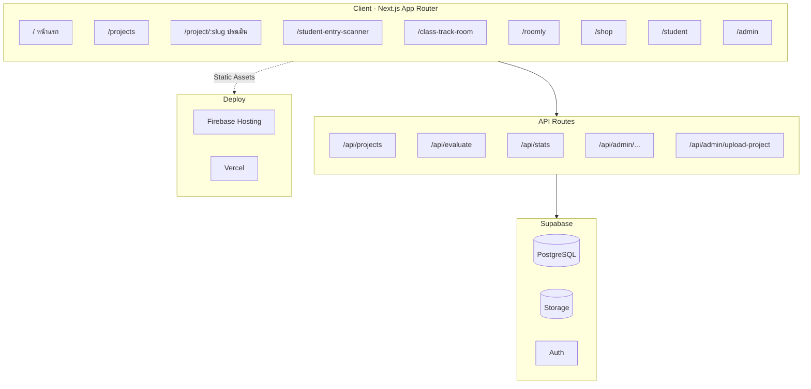
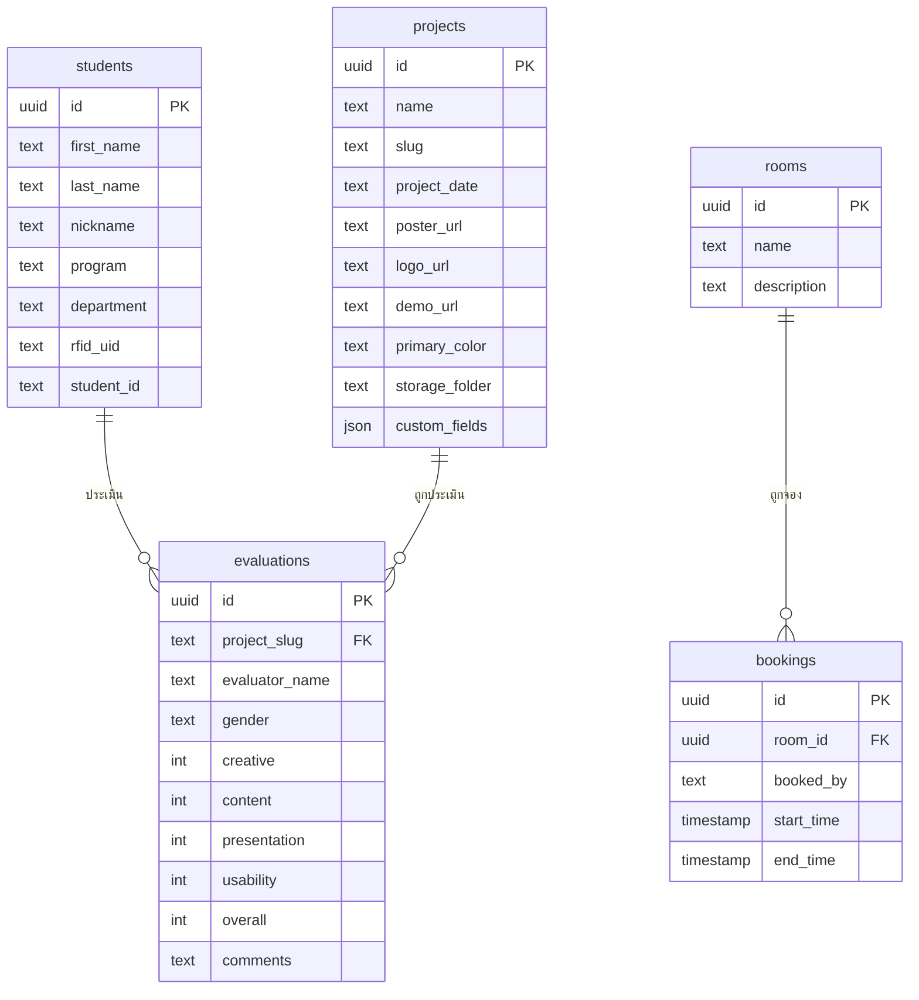

<div align="center">


# ASIA-BOT

**แพลตฟอร์มบริหารจัดการระบบนักเรียนครบวงจร**

[](https://nextjs.org)
[](https://react.dev)
[](https://www.typescriptlang.org)
[](https://supabase.com)
[](https://tailwindcss.com)
[](https://firebase.google.com)

[](https://asia-lb.web.app)

</div>

---

## ภาพรวม

ASIA-BOT คือระบบบริหารจัดการโรงเรียนแบบครบวงจร พัฒนาด้วย **Next.js 15 App Router** และ **Supabase** รวมทุกระบบที่นักเรียนและบุคลากรต้องการไว้ในที่เดียว ตั้งแต่บัตรนักเรียนดิจิทัล, ติดตามห้องเรียน, สแกนเข้า-ออก, จองห้องประชุม, ไปจนถึงระบบสหกรณ์และประเมินผลงาน

---

## ✨ ฟีเจอร์หลัก

| ระบบ | รายละเอียด |
|---|---|
| 🪪 **บัตรนักเรียนดิจิทัล** | QR Code ประจำตัว, ข้อมูลนักเรียน, แผนก/สาขา |
| 📡 **Student Entry Scanner** | สแกน RFID/QR บันทึกการเข้า-ออกโรงเรียนแบบเรียลไทม์ |
| 🏫 **Class Track Room** | ติดตามสถานะห้องเรียนและตารางสอนแบบ Live |
| 📅 **Roomly** | ระบบจองห้องประชุมออนไลน์พร้อม calendar view |
| 🛒 **สหกรณ์โรงเรียน** | ระบบสั่งซื้อสินค้าสหกรณ์รองรับ Stripe Payment |
| 📁 **โปรเจคนักเรียน** | แสดงผลงาน, ประเมินความพึงพอใจ, ดาวน์โหลดใบยืนยัน |
| 💬 **ความคิดเห็น** | ส่งข้อเสนอแนะและรายงานปัญหา |
| 🔧 **Admin Dashboard** | จัดการนักเรียน, โปรเจค, สินค้า, ห้อง และข้อมูลทั้งหมด |

---

## 🏗️ สถาปัตยกรรมระบบ



---

## 🗂️ โครงสร้างโปรเจค

```
src/
├── app/
│   ├── page.tsx                    # หน้าแรก
│   ├── projects/                   # รายการโปรเจค
│   ├── project/[slug]/             # หน้าประเมินโปรเจค
│   ├── student/                    # บัตรนักเรียนดิจิทัล
│   ├── student-entry-scanner/      # สแกนเข้า-ออก
│   ├── class-track-room/           # ติดตามห้องเรียน
│   ├── roomly/                     # จองห้องประชุม
│   ├── shop/                       # สหกรณ์โรงเรียน
│   ├── feedback/                   # ความคิดเห็น
│   ├── login/ & register/          # ระบบ Auth นักเรียน
│   ├── dashboard/                  # สถิติ
│   └── admin/                      # Admin Panel
│       ├── page.tsx                # จัดการทุกอย่าง
│       ├── setup/                  # ตั้งค่าครั้งแรก
│       └── recovery/               # กู้คืนบัญชี
├── components/
│   ├── Header.tsx / Footer.tsx
│   ├── Preloader.tsx               # Loading overlay
│   ├── Spinner.tsx                 # Inline spinner
│   ├── Notification.tsx            # Toast notification
│   ├── ProjectsGrid.tsx            # Grid โปรเจค
│   └── ...
├── lib/
│   ├── config.ts                   # ค่าคงที่, quick links, departments
│   ├── session.ts                  # Student session (localStorage)
│   └── admin-auth.ts               # Admin auth middleware
├── types/
│   └── database.ts                 # Supabase type definitions
└── app/api/                        # API Routes (server-side)
```

---

## 🛠️ เทคโนโลยี

| Layer | เทคโนโลยี |
|---|---|
| **Frontend** | Next.js 15.5, React 19, TypeScript 5.8 |
| **Styling** | Tailwind CSS 3.4, Font Awesome, Kanit font |
| **Database** | Supabase (PostgreSQL) |
| **Storage** | Supabase Storage (`project-images` bucket) |
| **Animation** | AOS (Animate on Scroll), Chart.js |
| **Payment** | Stripe |
| **Auth** | bcryptjs (Admin), localStorage session (Student) |
| **QR/RFID** | qrcode library |
| **Hosting** | Firebase Hosting / Vercel |

---

## 🚀 เริ่มต้นใช้งาน

### Prerequisites
- Node.js 18+
- Supabase project
- Firebase project (สำหรับ hosting)

### Installation

```bash
# Clone repository
git clone https://github.com/Centered101/asia-bot.git
cd asia-bot

# Install dependencies
npm install

# Copy environment variables
cp .env.example .env.local
```

### Environment Variables

```env
# Supabase
NEXT_PUBLIC_SUPABASE_URL=https://xxxx.supabase.co
NEXT_PUBLIC_SUPABASE_ANON_KEY=your_anon_key
SUPABASE_SERVICE_ROLE_KEY=your_service_role_key

# Admin
ADMIN_PASSWORD_HASH=your_bcrypt_hash
ADMIN_SECRET=your_secret_key

# App
NEXT_PUBLIC_SITE_URL=https://asia-lb.web.app
```

### Development

```bash
npm run dev        # start dev server (Turbopack)
npm run build      # production build
npm run start      # production server
```

---

## 🗃️ Database Schema (หลัก)



---

## 📦 Supabase Storage

```
project-images/
├── {slug}/           # แต่ละโปรเจคมี folder ของตัวเอง
│   ├── poster.jpg    # โปสเตอร์
│   ├── logo.png      # โลโก้
│   └── mascot.png    # มาสคอต
```

---

## 🎨 Theme

สี primary ทั้งเว็บควบคุมจาก CSS variable เดียว:

```css
:root {
  --primary-color: #84D4FA;   /* sky blue */
  --primary-dark:  #4DB8F5;
  --primary-light: #EAF7FF;
}
```

---

## 👥 ทีมพัฒนา

| GitHub | บทบาท |
|---|---|
| [@Centered101](https://github.com/Centered101) | Full-stack Developer |
| [@Centered101-dev](https://github.com/Centered101-dev) | Developer |

---

## 📄 License

© 2024–2026 ASIA-BOT — สงวนลิขสิทธิ์ทุกประการ
